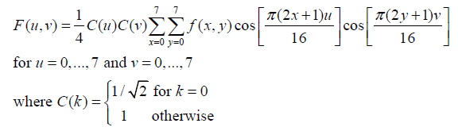
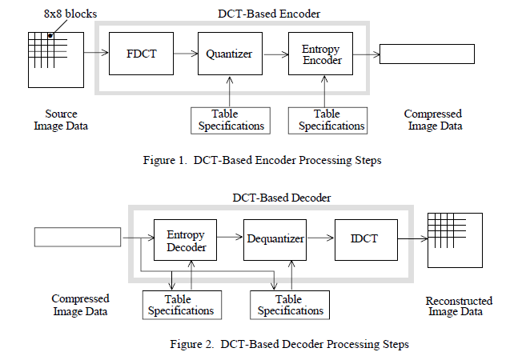
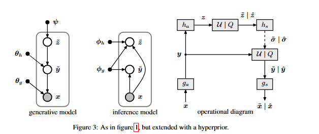
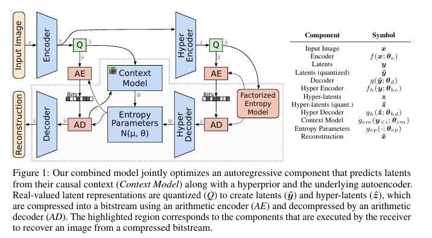
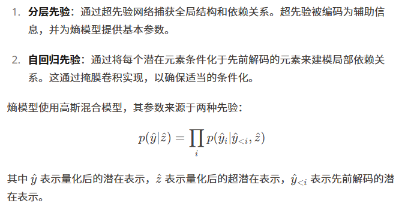
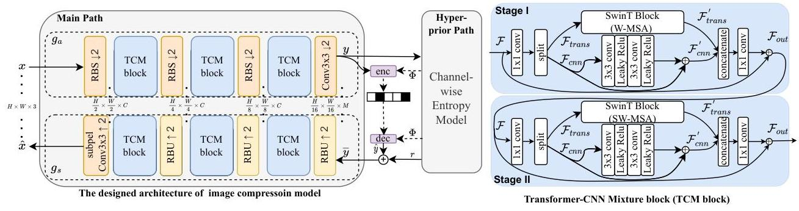
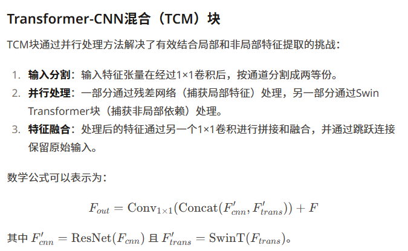
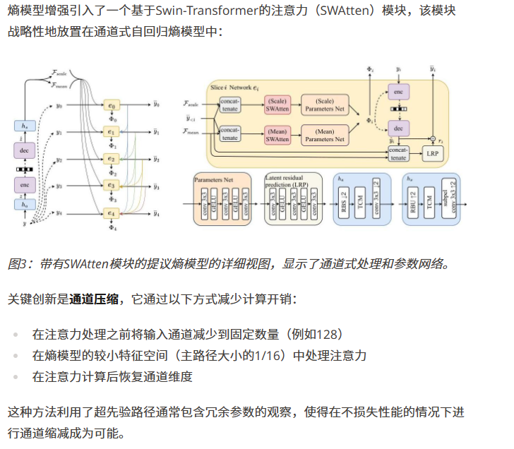

本文记录笔者学习图像压缩编码相关知识的notes.

### JPEG: The JPEG still picture compression standard

整体框架：

1. 颜色空间变换（RGB -> YCbCr）
 ↓
1. 分块（8×8）
 ↓
1. DCT（离散余弦变换）
 ↓
1. 量化（核心有损步骤）
 ↓
1. 熵编码（无损）

有损的压缩一步主要就是出在“量化”这里；下面我们来逐个部分大体解释这个“经典端到端框架”（人工端到端）干了什么。

#### 1. 颜色空间变换

目的：利用人眼特性，这也是体现“感知驱动压缩”的一步

Y：亮度（人眼极其敏感）

Cb / Cr：色度（人眼不太敏感）

之后我们的JPEG压缩会：

保留亮度更多信息

对色度进行更强压缩（甚至降采样）

#### 2. 分块

目的：降低计算复杂度，提高效率

为什么不整张图做？

整图太大，计算复杂

局部区域更“平稳”

代价：产生“block artifacts”（块效应）

#### 3. DCT

DCT这一块感觉细致的写还非常多且复杂，目前就先简单了解一下大体，可能之后如果有机会再深入学一下来填坑。

在进行FDCT变换之前，把64个无符号整型灰度值[0,255]平移到[-128,+127]范围中。

通过DCT变换，8×8个灰度值被转换为8×8个频率谱值，分别相应不同频率。DCT变换系数值均为实数。

低频谱值位于左上部分，高频谱值位于右下部分。通过下述公式可知。左上角F(0,0)相应频率为0，被称为DC系数，其它63个系数称为AC系数。

一个基本的想法是说要**把“像素值”变成“频率系数”**

motivation是说我们现在的“像素空间”的表达是一种“绝对值”，而相对好压缩的是说我们描述相对的变化程度（快慢），即“频率”

DCT提供的就是一种从“绝对的像素值”到“相对的频率系数”的映射，可以用矩阵乘法来表示。

Y = AXA^T

A是8×8的DCT变换矩阵，X是8×8的像素块，A^T是A的转置。

变换之后直觉理解：

左上角：低频（平滑区域）（接近（0，0）原点）

右下角：高频（边缘、噪声）

而自然图像的能量高度集中在低频，所以变换后你会看到：

少数系数很大，大多数系数接近 0

#### 4. 量化

通过一个量化表，量化表就是一个固定常数的8*8矩阵，相当于一张“不同频率允许有多粗糙”的规则表

通过 把 DCT 系数除以不同大小的数再取整，永久性地抹掉高频细节，从而实现有损压缩。

也因此，量化表的数据就反映了我们的“压缩程度”，是一个可调节的“quality factor”

DCT系数÷量化表→四舍五入，这样高频很可能变成0

得到的结果是一堆0，和少数较大的低频值

#### 5. 熵编码

最后的熵编码做的事：

出现频率高的符号，用更短的比特表示（详细展开好像有zigzag扫描，huffman编码）

当然这是无损压缩，不影响质量。

### VARIATIONAL IMAGE COMPRESSION WITH A SCALE HYPERPRIOR

传统的 JPEG 是靠数学公式（如 DCT 变换）来死板地处理图像。而这篇文章提出了一种基于**变分自编码器（VAE）**的架构。

编码器（Encoder）：就像是一个“翻译官”，把巨大的原始图像像素转换成一串非常精简的“密码”（潜变量 $y$）。

解码器（Decoder）：根据这串“密码”，尽可能还原出原来的图像。

超先验（Hyperprior）：这是本文核心贡献。作者发现，虽然第一层“密码”已经很小了，但这些密码内部仍然存在规律（空间相关性）。于是他增加了一层“超编码器”（侧枝路），专门用来学习这些密码的规律。这就像是**“为密码编写的密码”**，极大地提高了压缩效率。

1. 主干网络 (The Main Autoencoder)
这是处理图像数据的主力军，负责像素与压缩特征之间的转换。

分析变换 $g_a$（编码器）：

输入：$H\times W\times 3$ 的全彩色图像。
结构：由 4 层卷积层组成。每一层都使用了步长（Stride）为 2 的卷积来降低分辨率，同时增加通道数。
激活函数：使用了作者之前提出的 GDN (Generalized Divisive Normalization)。这是神经压缩的特有激活函数，模仿了生物神经元的抑制机制，非常擅长去除图像的局部相关性。
输出：潜变量 $y$。其空间尺寸只有原图的 $1/16 \times 1/16$，但通道数很多（通常是 128 或 192）。

合成变换 $g_s$（解码器）：

结构：$g_a$ 的镜像。使用反卷积（Transpose Convolution）逐步恢复图像尺寸。
激活函数：使用逆 GDN (IGDN)。
输出：重建图像 $\hat{x}$。

2. 超先验网络 (The Hyperprior Network)
这是本文最精华的“第二层自编码器”，它不处理像素，只处理 $y$。

超分析变换 $h_a$：

输入：主编码器的输出 $y$（取绝对值后输入，因为它只关心 $y$ 的分布幅度）。
结构：3 层简单的卷积层。进一步缩小尺寸。
输出：超潜变量 $z$。这是图像中最重要的“特征的特征”。

超合成变换 $h_s$：

输入：经过量化后的 $\hat{z}$。
输出：尺度参数 $\hat{\sigma}$。
关键点：$\hat{\sigma}$ 的尺寸与 $y$ 完全一致。它为 $y$ 的每一个元素都提供了一个对应的标准差估计。

3. 架构的运行逻辑：如何协同工作？
这个架构的精妙之处在于它是一个闭环系统：

压缩阶段：图像经过 $g_a$ 变成 $y$；同时 $y$ 经过 $h_a$ 变成 $z$。我们先对 $z$ 进行无损压缩（它很小，作为侧信息发送）；然后根据 $z$ 解出的 $\hat{\sigma}$，对 $y$ 进行极度高效的压缩。
解压阶段：接收方先解码出 $z$，通过 $h_s$ 拿到情报 $\hat{\sigma}$；有了情报，就能正确解码出 $y$；最后通过 $g_s$ 还原出图像。

当然仔细看的话，这篇论文是基于“VAE”来做的，和JPEG有一定区别：

传统的VAE：
![alt text]../(assets/post_images/compression/6d7b9a55-1eac-44bd-99ce-d0f414397482.png)

本文架构：

### Joint Autoregressive and Hierarchical Priors for Learned Image Compression

学习式的图像压缩方法通常使用自动编码器架构将图像转换为潜在表示，然后可以对其进行量化和熵编码。熵编码的效率取决于对潜在表示的概率分布建模的准确性。早期方法使用简单的、完全分解的熵模型，假设潜在变量之间相互独立。
最近的工作探索了分层模型，其中使用超先验来捕获潜在元素之间的空间依赖性。另外，自回归模型在生成建模中通过将每个元素都基于先前生成的元素进行条件化而取得了成功。然而，当单独使用这些方法时，它们存在局限性：

分层先验可以捕获全局结构，但会遗漏局部相关性
自回归模型可以很好地建模局部依赖性，但在长程依赖性方面表现不佳
自回归模型还会引入解码中的序列依赖性，影响性能

这项研究的关键见解是，这两种类型的先验可以相互补充。通过结合它们，模型可以同时利用来自超先验的全局信息和来自自回归上下文模型的局部依赖性。

模型架构
所提出的架构由几个关键组件组成：

主自动编码器：将输入图像转换为潜在表示（编码器），并从潜在表示中重建图像（解码器）。

超先验网络：由超编码器和超解码器组成。超编码器将潜在表示压缩为超潜在表示，这些超潜在表示也被量化和熵编码。超解码器重建熵模型的参数。

上下文模型：一个自回归模型，根据空间邻域中先前解码的元素预测每个潜在元素的分布。

熵参数网络：结合来自超先验和上下文模型的信息，生成条件高斯混合模型（GMM）的参数。

算术编码：根据熵模型对量化后的潜在表示进行压缩，以便存储或传输。

组合模型的操作如下：

编码器将输入图像转换为潜在表示。
超编码器进一步压缩潜在表示以创建超潜在表示。
超潜在表示被量化、熵编码并首先传输。
超解码器重建熵模型的参数。
在解码过程中，使用超先验信息和来自先前解码元素的上下文来顺序解码元素。
解码器从解码后的潜在表示重建最终图像。

这篇文章的核心就是在之前的那个超先验模型的基础上，增加了一个上下文模型。上下文模型可以捕获局部依赖性，而超先验可以捕获全局依赖性。作者认为，这两个模型可以相互补充，以更好地捕获图像的全局和局部依赖性。

### Learned Image Compression with Mixed Transformer-CNN Architectures

这篇文章的作者提出了一个混合的Transformer-CNN架构，它结合了Transformer和CNN的优点。

它们主要使用基于CNN或基于Transformer的架构，但未能有效地结合两者。CNN擅长捕获局部空间特征和精细细节，而Transformer则在建模长距离依赖和全局上下文方面表现出色。本研究解决了这个关键问题：我们如何有效地融合这些互补能力以实现卓越的压缩性能？

现有方法中的两个主要挑战：

架构限制：大多数方法未能同时利用局部和非局部建模能力。
熵建模效率低下：当前用于熵模型的注意力机制要么计算成本高昂，要么范围有限。

技术方法
所提出的方法建立在变分自编码器（VAE）框架之上，并具有两项关键创新：Transformer-CNN混合（TCM）块和用于熵建模的参数高效注意力机制。

TCM

Swin Transformer(SWAtten)

未完待续……

